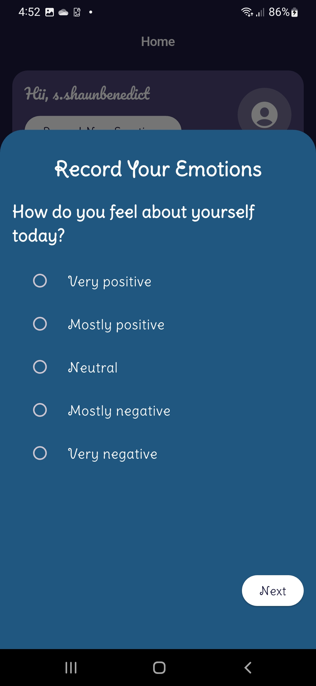

<p align="center">
  
</p>

<h1 align="center">🌙 MoodyLune</h1>

MoodyLune is a mental health companion app built with **Flutter**. It helps users track their moods, journal their feelings, and optionally chat with an AI counselor for support.

## Features

**Splash Screen**  
Beautiful moon-themed splash screen on startup.

**User Authentication**  
- Sign up / Login with email & password
- Save user profile photo, username, and date of birth

**Home Screen**  
- Personalized greeting
- Quick access to record emotions
- See today’s mood, journal entries, and moon phase info

**Emotion Surveys**  
- Dynamic questionnaires fetched from Firestore
- Multi-page animated survey
- Save answers to Firebase

**Mood Check-In**  
- Choose from 15 moods via emoji
- Save daily moods in Firestore

**Journal**  
- Write daily journal entries
- View old entries in read-only mode

**AI Counselor (Coming Soon)**  
- Chat with MoodyLune AI for emotional support
- Simulated chat UI in development

**Settings**  
- Edit profile data
- Change password
- Update profile photo
- Delete account

## 💻 Tech Stack

- Flutter 3.x
- Firebase Auth
- Cloud Firestore
- Google Fonts
- Cupertino & Material Design

## ScreenShots

<table>
  <tr>
    <td></td>
    <td></td>
    <td></td>
  </tr>
  <tr>
    <td></td>
    <td></td>
    <td></td>
  </tr>
  <tr>
    <td></td>
    <td></td>
    <td></td>
  </tr>
</table>

## 🔧 Getting Started

Clone this repo:

```bash
git clone https://github.com/shaun-shaju/moodylune.git
cd moodylune
flutter pub get